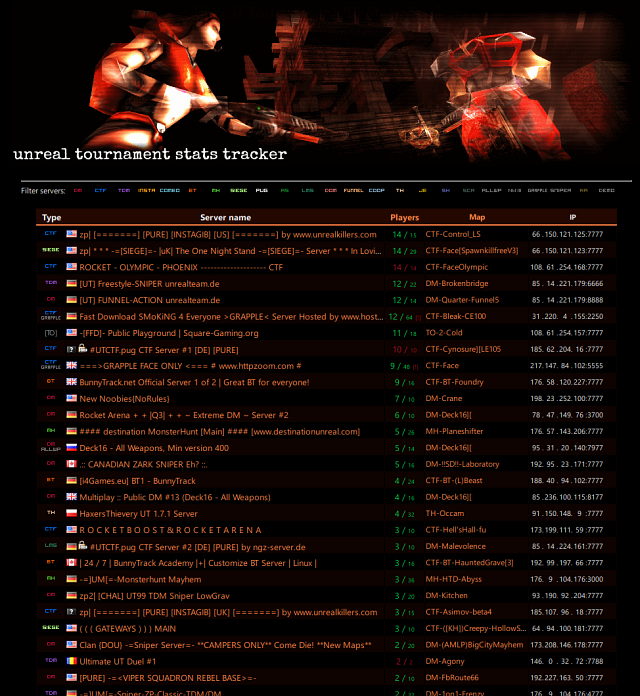

# Unreal Tournament Stats Tracker
## Disclaimer
This is an excercise project on data collection and analysis I made 
between 2014-2016.

The purpose of this repo is strictly archival. 
**I strongly recommend against running it in production.** 
There are probably tons of bugs and vulnerabilities present
due to usage of ancient coding patterns. I cannot guarantee
this will run in any modern environment. [10 reasons why the code sucks](#10-reasons-why-the-code-sucks)

## About
Unreal Tournament Stats Tracker allows you to view various statistics 
about players and servers. Also, it presents some detailed informations 
about maps, including automatically generated map layouts. 
The site used to be running at the address http://tracker.ut99.tk

## Requirements
### Web frontend
- Apache 2.4
- PHP >= 5.3, with extensions:
  - pdo
  - mbstring
  - gd
- MySQL or MariaDB
  - To get the Server Scanner to work, MySQL >= 8.0 require changing user auth to `mysql_native_password` [(info)](https://dev.mysql.com/doc/refman/8.4/en/caching-sha2-pluggable-authentication.html)

### Server scanner
- Windows
- .NET Framework Runtime 4

### Map downloader
If you want to run Map Downloader, you'll also need:
- Windows VM with UT installation
- PHP configured for CLI usage, with curl extension

## Installation
Create a dedicated database on your MySQL/MariaDB server. This can be done easily with a tool like [PHPMyAdmin](https://github.com/phpmyadmin). I'm using name `utt` in the example. 

Additionaly, add new user that will be accessing the database. In my example, `uttWeb`.

**It's a good practice to create different database users for frontend, scanner, and map downloader.**
Web frontend user only needs modification permissions for tables:
- mapinfo: INSERT, UPDATE
- mapdownloadqueue: INSERT
- serverqueue: INSERT

**For the time of installation, CREATE TABLE permission should also be granted to web frontend user.**

Permissions needed for Map Downloader:
- mapdownloadqueue: SELECT, DELETE

### Configuration files
Edit config files for your instance. Each component has its own separate file with configuration:
- Web frontend:
  `/appConfig.php` (remove .dist extension)
- Server scanner: 
  `/Scanner/bin/[buildType]/utt_updater3.ini` (remove .dist extension)
- UT Map Downloader:
  `/UTMP/mapdlcron2.php`
- Wireframe renderer:
  `/WireframeRenderer/RendererConfig.php`

After you configure all components, run installer script. To create database structure, use /Installer/index.php script. This is initiated from web, just navigate to:

`https://<my-server>/Installer/index.php`

  
### Directories explained:
- Assets - static files (graphics, styles, js, etc)
- Installer - setup script
- Locale - language files
- N14Core = Namonaki14's Completely Oosless and Redundant Extensions
- N14Data = used by some of the generic purpose scripts
- N14Inc - additional includes
- Scanner - VB.NET server scanner and master server
- UTMDC = UT Map Download CSomething, database of map download links
- UTMP = UT Map Page content - screenshots, layouts, map reports, etc.
    Also, the directory of Map Downloader.
- WireframeRenderer - script creating map layout images from T3D files

## 10 reasons why the code sucks
AKA Why it was nice from the user side, but a future maintainer's nightmare.

1. No project structure whatsoever - `common.php` and other gigantic files, containing mixed procedural code, function definitions and much too much random things.
2. Database management is all over the place. Which part of the code is responsible for creating DB connection? Each page! In a boilerplate code. That leads to...
3. SQLEngine - a sign of quick'n'dirtiness of the project. Parameter binding? Forget it! This is derived from even older thing that dates back to the times of mysql_* functions. *[Dangaros!](https://www.youtube.com/watch?v=R6lbYUDSxlE)*
4. No regard for variable declaration, property declaration, no bulletproof input sanitizing.
5. No separation of data and presentation. Structure of database is hardcoded, the code makes a lot of assumptions. For this very reason, the 2016 release was impossible to deploy - installer contained older version of database structure. As a result, the server scanner depended on non-existing columns in DB.
6. N14Core was supposed to implement autoloading, pipelining, session handling, configuration and lots of redundant things. It does none of the above in UTT.
7. RegExp in Wireframe Renderer
8. Focused on Windows - many of the tools are written with MS environment in mind. 
   - Map downloader is a PHP CLI tool wrapped in a Batch file, depending on Windows shell operations and tools.
   - Server scanner is written in VB.NET, at the time of release Linux version of .NET Core was still new.
9. Tons of dead code, useless comments, while lacking any documentation 99% of times. *I should have learned how to Git.*
10. There is no point 10. I guess, maybe it could be that *the project was not so serious from the start*. And so is its post-mortem.
